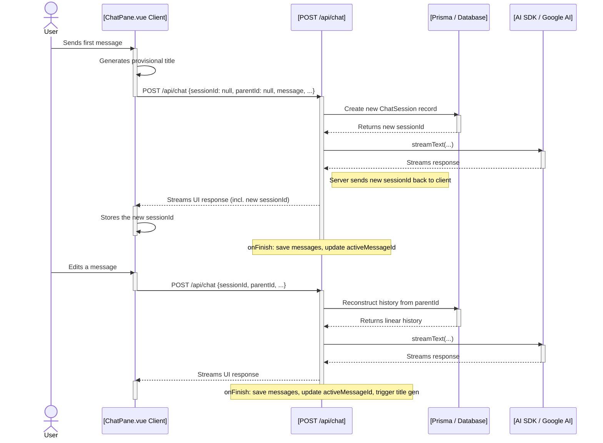
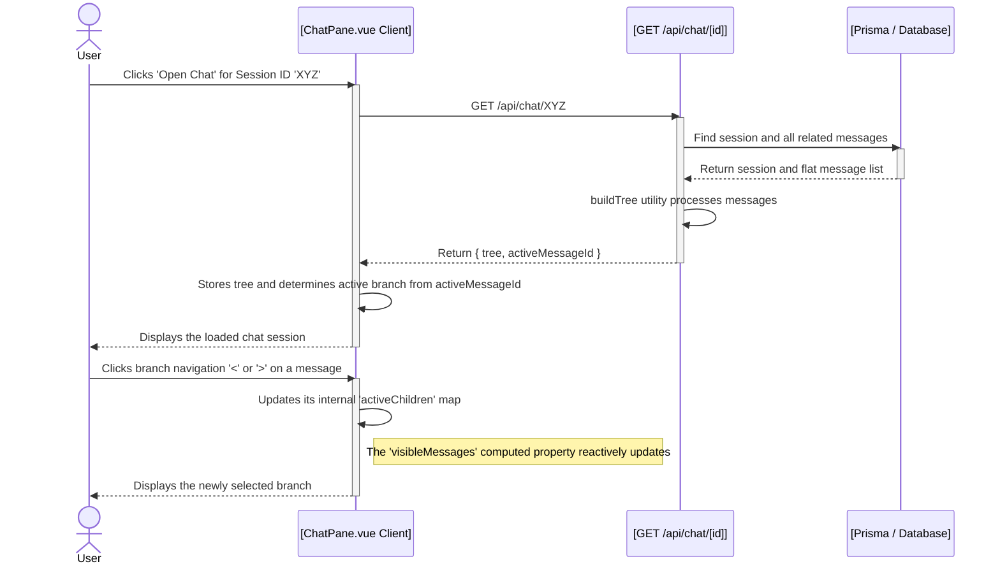

# Plan: Implementing Persistent, Branching Conversations with a History Dialog

This document outlines the plan to upgrade the existing chat application to support a persistent, tree-based conversation model with a `shadcn-vue` dialog for browsing chat history and in-line controls for navigating between conversation branches.

### Goal

To create a system where:
1.  Chat conversations, including AI tool usage, are saved to a database with branching support.
2.  The initial URL of a chat is recorded.
3.  The last active branch of a conversation is remembered and restored automatically.
4.  A user can browse their chat history in a dialog.
5.  New chats receive a provisional, timestamp-based title that is later updated by a lightweight AI model.
6.  From the dialog, a user can load a past chat or navigate to its original page.
7.  Users can navigate between different conversation branches using a pagination-style control (`< 1/3 >`).

---

## 1. Step 1: Database Schema

The Prisma schema will be updated with more descriptive model names and all necessary fields.

```prisma
// In your prisma/schema.prisma

model User {
  // ... existing User fields
  chatSessions ChatSession[]
}

model ChatSession {
  id        String    @id @default(cuid())
  title     String?
  userId    String
  user      User      @relation(fields: [userId], references: [id])
  messages  ChatMessage[]
  createdAt DateTime  @default(now())
  updatedAt DateTime  @updatedAt
  sourceUrl String?
  activeMessageId String?
}

model ChatMessage {
  id         String    @id @default(cuid())
  sessionId  String
  session    ChatSession @relation(fields: [sessionId], references: [id])
  parentId   String?
  parent     ChatMessage?  @relation("MessageChildren", fields: [parentId], references: [id], onDelete: NoAction, onUpdate: NoAction)
  children   ChatMessage[] @relation("MessageChildren")
  role       String    // 'user' or 'assistant'
  content    Json
  createdAt  DateTime  @default(now())
}
```

---

## 2. Step 2: Backend API Endpoints & Logic

### Data Flow Diagrams

#### New Chat & Branching Flow


#### Loading & Navigation Flow


### API Endpoint Details
- **`POST /api/chat`**: Handles creating/continuing conversations.
- **`GET /api/chats`**: Fetches the list of all `ChatSession` records for the user.
- **`GET /api/chat/[id]`**: Fetches a single `ChatSession` and its full message tree.

---

## 3. Step 3: Frontend Implementation

- **`ChatPane.vue`**: Will be refactored to manage the full message tree state, handle the history dialog, and manage the provisional title logic.
- **`HistoryDialog.vue`**: A new component to display the list of chat sessions.
- **`Message.vue`**: Will be updated to display the `< 1/3 >` branch navigation controls.

This fully detailed plan now covers the complete data flow, error conditions, and utility function signatures, making it a clear guide for implementation.