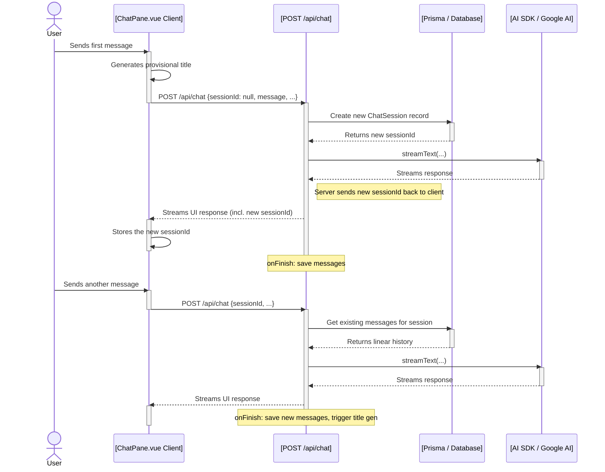
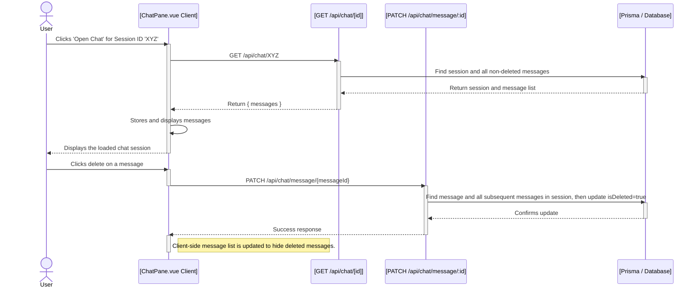

# Plan: Implementing Persistent, Linear Conversations with a History Dialog

This document outlines the plan to upgrade the existing chat application to support a persistent, linear conversation model with a `shadcn-vue` dialog for browsing chat history.

### Goal

To create a system where:
1.  Chat conversations are saved to a database in a simple, linear sequence.
2.  The initial URL of a chat is recorded.
3.  A user can browse their chat history in a dialog.
4.  New chats receive a provisional, timestamp-based title that is later updated by a lightweight AI model.
5.  From the dialog, a user can load a past chat or navigate to its original page.
6.  Users can soft-delete a message, which will hide it and all subsequent messages in that session by setting an `isDeleted` flag.

---

## 1. Step 1: Database Schema

```prisma
// In your prisma/schema.prisma

model User {
  // ... existing User fields
  chatSessions ChatSession[]
}

model ChatSession {
  id        String    @id @default(cuid())
  title     String?
  userId    String
  user      User      @relation(fields: [userId], references: [id])
  messages  ChatMessage[]
  createdAt DateTime  @default(now())
  updatedAt DateTime  @updatedAt
  sourceUrl String?
}

model ChatMessage {
  id         String    @id @default(cuid())
  sessionId  String
  session    ChatSession @relation(fields: [sessionId], references: [id])
  role       String    // 'user' or 'assistant'
  content    Json
  createdAt  DateTime  @default(now())
  isDeleted  Boolean   @default(false)
}
```

> **Note on Deletion**: The schema uses an `isDeleted` flag for soft deletes. When a message is deleted, all subsequent messages in the same session will also be marked as deleted in the application logic.

---

## 2. Step 2: Backend API Endpoints & Logic

### Data Flow Diagrams

#### New Chat & Continuation Flow


#### Loading & Deleting Flow


### API Endpoint Details
- **`POST /api/chat`**: Handles creating/continuing linear conversations.
- **`GET /api/chats`**: Fetches the list of all `ChatSession` records for the user.
- **`GET /api/chat/[id]`**: Fetches a single `ChatSession` and its linear message history, filtering out soft-deleted messages.
- **`PATCH /api/chat/message/[id]`**: Soft-deletes a message and all subsequent messages in the session by setting `isDeleted: true`.

---

## 3. Step 3: Frontend Implementation

- **`ChatPane.vue`**: Will be refactored to manage a linear message list, handle the history dialog, and call the API for message deletion.
- **`HistoryDialog.vue`**: component to display the list of chat sessions.
- **`Message.vue`**: Will be simplified, removing any branching-related UI controls.

### Note on Current Chat Loading Simulation
The current implementation simulates loading chat history without a database.
- `components/ChatPane.vue` initializes the chat with a hardcoded `initialMessages` array.
- `components/Chat/HistoryDialog.vue` contains a `sampleConversations` array. When a user selects a conversation from the dialog, it emits a `loadChat` event with the sample messages.
- `ChatPane.vue` listens for this event and replaces its current messages with the sample data.

This existing simulation logic will be replaced by API calls to fetch real conversation data from the database as outlined in this plan.

### Note on New Chat Session Creation
A new chat session is created when the user sends the first message in a new, empty chat pane.
- The client sends a `POST` request to `/api/chat` with a `null` `sessionId`.
- The backend identifies this as a request to start a new conversation and creates a new `ChatSession` record in the database.
- The newly created `sessionId` is then returned to the client with the first response stream.
- The client stores this `sessionId` and includes it in all subsequent requests for the remainder of the session.

---

### Important Note on Vercel AI SDK
> **Warning**: The Vercel AI SDK is subject to rapid development and has introduced breaking changes. To ensure compatibility and correct usage, it is crucial to consult the latest documentation using the `context7` tool before implementing any AI SDK-related features.

This fully detailed plan now covers the complete data flow, error conditions, and utility function signatures, making it a clear guide for implementation.