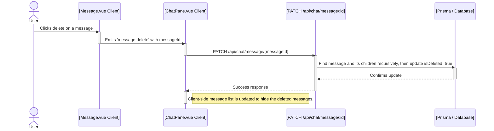

# Plan: Implementing Persistent, Branching Conversations with a History Dialog

This document outlines the plan to upgrade the existing chat application to support a persistent, tree-based conversation model with a `shadcn-vue` dialog for browsing chat history and in-line controls for navigating between conversation branches.

### Goal

To create a system where:
1.  Chat conversations, including AI tool usage, are saved to a database with branching support.
2.  The initial URL of a chat is recorded.
3.  The last active branch of a conversation is remembered and restored automatically.
4.  A user can browse their chat history in a dialog.
5.  New chats receive a provisional, timestamp-based title that is later updated by a lightweight AI model.
6.  From the dialog, a user can load a past chat or navigate to its original page.
7.  Users can navigate between different conversation branches using a pagination-style control (`< 1/3 >`).
8.  Users can soft-delete a message, which will hide it and all subsequent messages in that branch by setting an `isDeleted` flag.

---

## 1. Step 1: Database Schema

```prisma
// In your prisma/schema.prisma

model User {
  // ... existing User fields
  chatSessions ChatSession[]
}

model ChatSession {
  id        String    @id @default(cuid())
  title     String?
  userId    String
  user      User      @relation(fields: [userId], references: [id])
  messages  ChatMessage[]
  createdAt DateTime  @default(now())
  updatedAt DateTime  @updatedAt
  sourceUrl String?
  activeMessageId String?
}

model ChatMessage {
  id         String    @id @default(cuid())
  sessionId  String
  session    ChatSession @relation(fields: [sessionId], references: [id])
  parentId   String?
  parent     ChatMessage?  @relation("MessageChildren", fields: [parentId], references: [id], onDelete: NoAction, onUpdate: NoAction)
  children   ChatMessage[] @relation("MessageChildren")
  role       String    // 'user' or 'assistant'
  content    Json
  createdAt  DateTime  @default(now())

  // New field for soft deletion
  isDeleted Boolean       @default(false)
}
```

> **Note on Deletion**: The schema uses an `isDeleted` flag for soft deletes. The `parent-child` relationship on `ChatMessage` uses `onDelete: NoAction`. This is intentional to prevent accidental cascading deletes. Deleting a message and its branch of children must be handled in the application logic by recursively finding all descendants and setting their `isDeleted` flag to `true`.

---

## 2. Step 2: Backend API Endpoints & Logic

### Data Flow Diagrams

#### New Chat & Branching Flow


#### Loading & Navigation Flow


#### Soft-Deleting a Message Flow


### API Endpoint Details
- **`POST /api/chat`**: Handles creating/continuing conversations.
- **`GET /api/chats`**: Fetches the list of all `ChatSession` records for the user.
- **`GET /api/chat/[id]`**: Fetches a single `ChatSession` and its full message tree, filtering out soft-deleted messages.
- **`PATCH /api/chat/message/[id]`**: Soft-deletes a message and its entire subtree of replies by setting `isDeleted: true`.

---

## 3. Step 3: Frontend Implementation

- **`ChatPane.vue`**: Will be refactored to manage the full message tree state, handle the history dialog, manage the provisional title logic, and call the new API endpoint for soft-deleting messages.
- **`HistoryDialog.vue`**: component to display the list of chat sessions.
- **`Message.vue`**: Will be updated to display the `< 1/3 >` branch navigation controls.

### Note on Current Chat Loading Simulation
The current implementation simulates loading chat history without a database.
- `components/ChatPane.vue` initializes the chat with a hardcoded `initialMessages` array.
- `components/Chat/HistoryDialog.vue` contains a `sampleConversations` array. When a user selects a conversation from the dialog, it emits a `loadChat` event with the sample messages.
- `ChatPane.vue` listens for this event and replaces its current messages with the sample data.

This existing simulation logic will be replaced by API calls to fetch real conversation data from the database as outlined in this plan.

### Note on New Chat Session Creation
A new chat session is created when the user sends the first message in a new, empty chat pane.
- The client sends a `POST` request to `/api/chat` with a `null` `sessionId`.
- The backend identifies this as a request to start a new conversation and creates a new `ChatSession` record in the database.
- The newly created `sessionId` is then returned to the client with the first response stream.
- The client stores this `sessionId` and includes it in all subsequent requests for the remainder of the session.

---

This fully detailed plan now covers the complete data flow, error conditions, and utility function signatures, making it a clear guide for implementation.