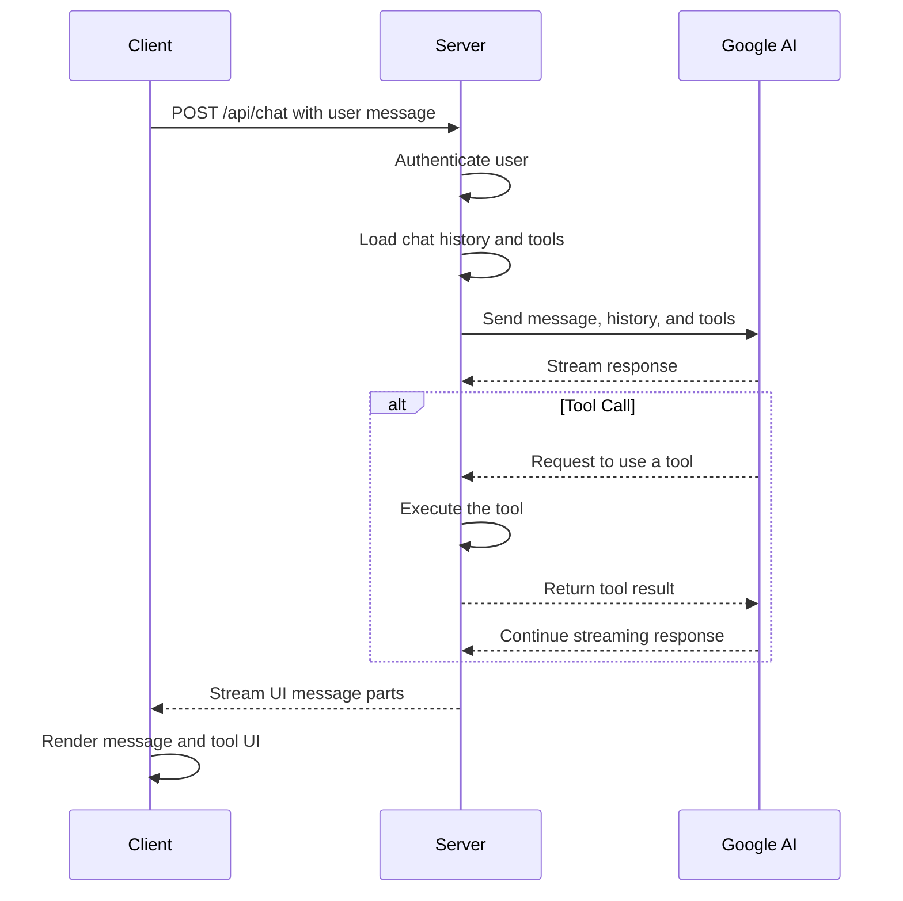

# Nuxt 4 AI SaaS Template

[](https://github.com/PramaAditya/nuxt_template/generate)

This is a comprehensive template for building AI-powered Software-as-a-Service (SaaS) applications using a modern, robust, and scalable tech stack. It provides a solid foundation with pre-configured authentication, database integration, UI components, and AI model connectivity.

## ✨ Features

*   **User Authentication:** Secure login, logout, and session management powered by Logto.
*   **AI Chat Interface:** A ready-to-use chat interface using the Vercel AI v5 SDK and Google Gemini Pro.
*   **Persistent Chat History:** User-specific chat history is saved to the database, allowing users to resume conversations.
*   **Database Integration:** Type-safe database access with Prisma ORM connected to a PostgreSQL database.
*   **Server-Side Logic:** Nuxt 4 server routes for creating API endpoints.
*   **Reusable Components:** A clean and consistent UI built with Shadcn-Vue.
*   **Scalable Deployment:** Ready for deployment using Docker.

## 🛠️ Tech Stack

This template is built with the following technologies:

*   **Framework:** **[Nuxt 4](https://nuxt.com/docs)**
    *   A powerful Vue.js framework for building server-side rendered (SSR) and static websites. We leverage its *server routes*, *composables*, and rich ecosystem.

*   **Database:** **[PostgreSQL](https://www.postgresql.org/)**
    *   A powerful, open-source object-relational database system. This template is configured for PostgreSQL. For a quick start with a serverless option, I recommend **[Neon DB](https://neon.tech/docs)**, which offers a generous free tier.

*   **Authentication:** **[Logto](https://docs.logto.io/)**
    *   An Auth-as-a-Service solution that handles user authentication (login, logout, session management) via its generous free tier.

*   **ORM:** **[Prisma](https://www.prisma.io/docs/)**
    *   A next-generation Node.js and TypeScript ORM that ensures type-safe and structured interaction with your PostgreSQL database.

*   **UI/Components:** **[Shadcn-Vue](https://www.shadcn-vue.com/docs.html)**
    *   A library of beautifully designed and accessible UI components to build a clean and consistent user interface.

*   **LLM & AI SDK:**
    *   **Model:** **Google Gemini 2.5 Pro and Flash** (Get your free API Key from [Google AI Studio](https://aistudio.google.com/)).
    *   **Library:** **[Vercel AI v5 SDK](https://sdk.vercel.ai/docs)**. The `useChat` hook simplifies the integration with the LLM and manages response streaming on the client side.

*   **Deployment:** **[Docker](https://www.docker.com/)**
    *   Containerize your application for consistent and reliable deployment using a Dockerfile.

*   **Nuxt Modules:** This template comes with several pre-installed Nuxt modules to enhance development:
    *   **[@nuxt/fonts](https://fonts.nuxt.com/)**: For optimizing and managing local and web fonts.
    *   **[@nuxt/icon](https://icon.nuxt.com/)**: For adding and managing icons from any icon set.
    *   **[@nuxt/scripts](https://scripts.nuxt.com/)**: For managing third-party scripts with ease.
    *   **Testing:**
        *   **[@nuxt/test-utils](https://nuxt.com/docs/getting-started/testing)**: Utilities for testing your Nuxt application.

## 🚀 Getting Started

### Prerequisites

*   Node.js (v22.21.0 or higher)
*   npm (or pnpm/yarn)
*   A PostgreSQL Database. For a quick serverless setup, you can use **[Neon](https://neon.tech/docs)**.
*   Accounts for Logto and Google AI Studio.

### Installation

1.  **Create a repository from this template:**
    *   Click the "Use this template" button above to create a new repository.

2.  **Clone your new repository:**
    ```bash
    git clone https://github.com/YOUR_USERNAME/YOUR_REPOSITORY.git
    cd YOUR_REPOSITORY
    ```

3.  **Install dependencies:**
    ```bash
    pnpm install
    ```

4.  **Set up environment variables:**
    *   Copy the `.env.example` file to `.env`.
    *   Fill in the required API keys and credentials for your database, Logto, and Google. Your `.env` file should look like this:
        ```env
        ENVIRONMENT= # Set the environment (development, production, etc.)
        DEBUG= # Enable or disable debug mode, true or false

        # Logto Credentials
        NUXT_LOGTO_APP_ID=
        NUXT_LOGTO_APP_SECRET=
        NUXT_LOGTO_COOKIE_ENCRYPTION_KEY=
        NUXT_LOGTO_ENDPOINT=

        # PostgreSQL Database Connection String (Example from Neon)
        DATABASE_URL="postgresql://***:***?sslmode=require&channel_binding=require"

        # Google Gemini API Key
        GOOGLE_GENERATIVE_AI_API_KEY=

        # AI Models
        NUXT_PUBLIC_AI_FREE_MODEL="gemini-2.5-flash-latest"
        NUXT_PUBLIC_AI_PREMIUM_MODEL="gemini-2.5-pro-latest"
        ```

5.  **Run the development server:**
    ```bash
    pnpm dev
    ```

Your application should now be running on `http://localhost:3000`.

## API Endpoints

The template includes the following server-side API endpoints for managing chat functionality:

*   **`POST /api/chat`**: Creates a new chat session.
*   **`GET /api/chats`**: Retrieves all chat sessions for the authenticated user.
*   **`GET /api/chat/:id`**: Retrieves a specific chat session by its ID.
*   **`PATCH /api/chat/:id`**: Updates a specific chat session (e.g., changing the title).
*   **`DELETE /api/chat/:id`**: Deletes a specific chat session.
*   **`PATCH /api/chat/message/:id`**: Updates a specific chat message (e.g., soft-deleting).
*   **`GET /api/me`**: Retrieves the profile of the currently authenticated user.

## Deployment

This template is configured for deployment using Docker.

1.  **Build the Docker image:**
    ```bash
    docker build -t your-app-name .
    ```
2.  **Run the container:**
    ```bash
    docker run -d -p 3000:3000 --env-file .env your-app-name
    ```
Your application will be running in a containerized environment. Make sure your `.env` file is correctly configured for the production environment.


## AI Chat Modes

This template includes a system for creating different AI chat modes, each with its own persona, system prompt, and set of available tools. You can find the configuration for the chat modes in the `server/ai-chat/modes` directory.

### Default Mode

*   **Persona**: Roo, a versatile, creative, and knowledgeable AI assistant.
*   **Purpose**: To assist users with a wide range of tasks, provide accurate information, and handle requests efficiently.
*   **Features**:
    *   General-purpose chat.
*   **Tools**: None enabled by default.

### Baqir Mode

*   **Persona**: Pak Baqir, a patient and friendly AI math tutor.
*   **Purpose**: To guide elementary school students (grades 4-6) in solving math problems without providing the final answers.
*   **Features**:
    *   Specialized for math tutoring.
    *   Guides students through the problem-solving process.
*   **Tools**:
    *   `calculator`: A tool for evaluating mathematical expressions.

## Working with AI Tools

This template includes a powerful system for integrating AI tools into your chat interface. This allows the AI to perform actions and retrieve information from external sources, making it more capable and versatile.

### AI Tool Call Workflow Analysis

The following is a high-level overview of the end-to-end workflow for AI tool calls, from the client request to the server-side execution and response rendering.

#### Sequence Diagram



#### Key Files, Functions, and Data Structures

**Client-Side:**

*   **`pages/chat.vue`**: The main chat page that enables the chat feature.
*   **`components/ChatPane.vue`**: The core chat component that manages the chat state and sends messages to the server.
*   **`components/Chat/Tool.vue`**: A component that dynamically renders the UI for a tool based on its name.
*   **`components/Chat/tools/*.vue`**: Individual Vue components for rendering the UI of specific tools (e.g., `Calculator.vue`).
*   **`UIMessage`**: A data structure from the `ai` library that represents a message in the chat interface. It can contain text, tool calls, and tool results.

**Server-Side:**

*   **`server/api/chat.post.ts`**: The main API endpoint for handling chat messages. It uses the `streamText` function to interact with the AI model and execute tools.
*   **`server/ai-chat/modes/**/*.ts`**: Files that define the different chat modes, including their system prompts and available tools.
*   **`server/ai-chat/tools/**/*.ts`**: Files that define the server-side implementation of the tools.
*   **`tool` function**: A function from the `ai` library used to define a tool's description, input schema, and execution logic.

### Guide: Adding a New Server-Side Tool

Here's a step-by-step guide to adding a new server-side tool.

**1. Create the Tool File**

Create a new file in the `server/ai-chat/tools` directory. For this example, we'll create a simple "hello world" tool in a file named `hello.ts`.

```typescript
// server/ai-chat/tools/hello.ts
import { tool } from 'ai';
import { z } from 'zod';

export const helloTool = tool({
  description: 'A simple tool that returns a "hello world" message.',
  inputSchema: z.object({
    name: z.string().describe('The name to include in the message.'),
  }),
  execute: async ({ name }: { name: string }) => {
    return { message: `Hello, ${name}!` };
  },
});
```

**2. Register the Tool**

Open the `server/ai-chat/tools/index.ts` file and add the new tool to the `tools` object.

```typescript
// server/ai-chat/tools/index.ts
import { calculatorTool } from './calculator';
import { helloTool } from './hello';

export const tools = {
  calculator: calculatorTool,
  hello: helloTool,
};
```

**3. Enable the Tool in a Chat Mode**

Open the `server/ai-chat/modes/default/tools.ts` file and add the new tool to the `tools` object.

```typescript
// server/ai-chat/modes/default/tools.ts
import { tools } from '~/server/ai-chat/tools';

export { tools };
```

Now, the "hello" tool is available to the AI in the `default` chat mode.

### Guide: Creating a Custom Client-Side Tool UI

Here's a step-by-step guide to creating a custom UI component to render a tool's result on the client.

**1. Create the Tool UI Component**

Create a new Vue component in the `components/Chat/tools` directory. The component's name should be the PascalCase version of the tool's name. For our "hello" tool, we'll create a file named `Hello.vue`.

```vue
<!-- components/Chat/tools/Hello.vue -->
<script setup lang="ts">
import type { ToolUIPart } from "ai";
import type { UITools } from "~/types/tools";

defineProps<{
  part: ToolUIPart<UITools>;
}>();
</script>

<template>
  <div v-if="part.type === 'tool-hello'">
    <div v-if="part.state === 'output-available'">
      <p>{{ part.output.message }}</p>
    </div>
    <div v-else>
      <p>Thinking...</p>
    </div>
  </div>
</template>
```

**2. Update the UI Tools Type**

Open the `types/tools.ts` file and add the new tool to the `UITools` type definition.

```typescript
// types/tools.ts
export type UITools =
  | {
      type: 'tool-calculator';
      input: { expression: string };
      output: { result: number } | { error: string };
    }
  | {
      type: 'tool-hello';
      input: { name: string };
      output: { message: string };
    };
```

Now, when the AI uses the "hello" tool, the `Hello.vue` component will be automatically rendered in the chat interface to display the result.
